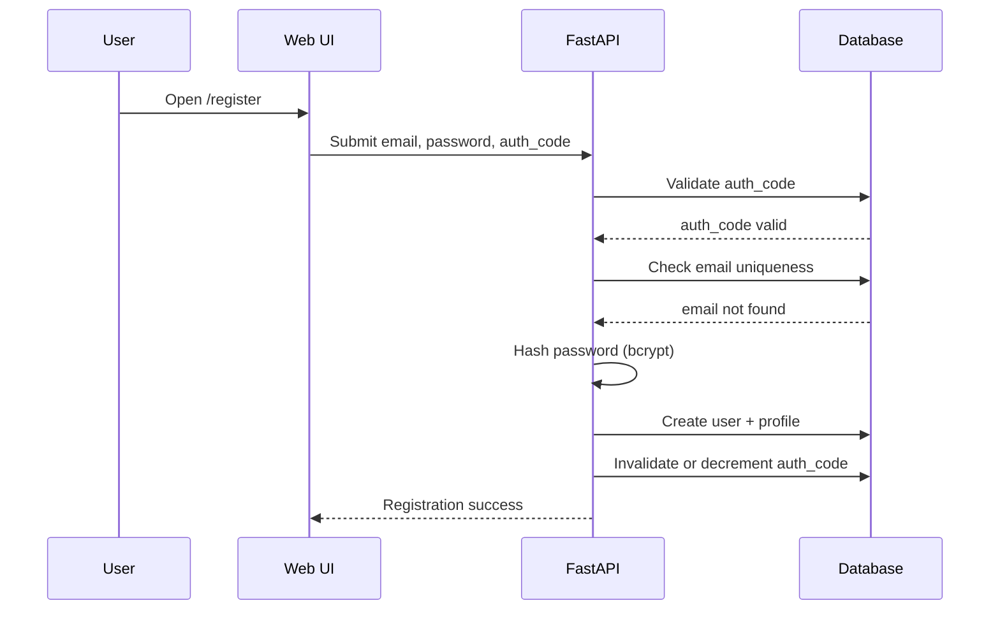
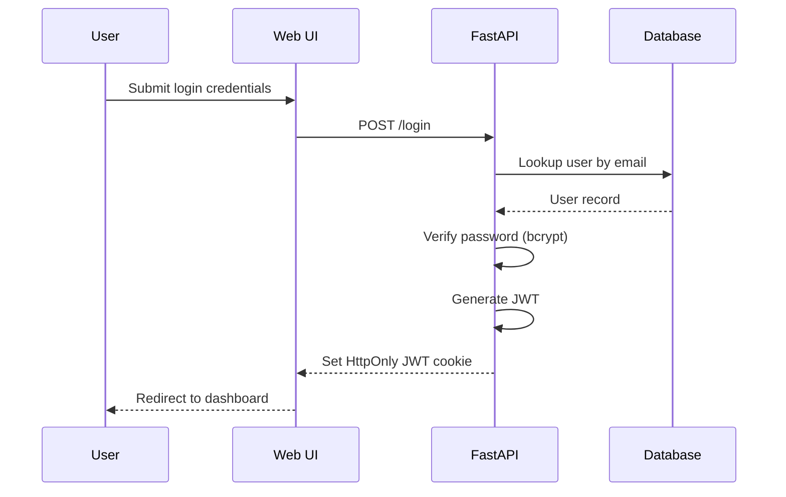
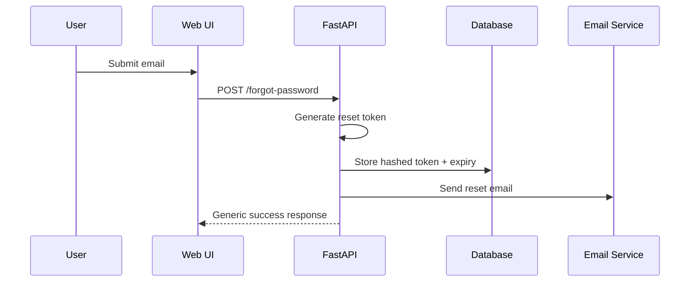
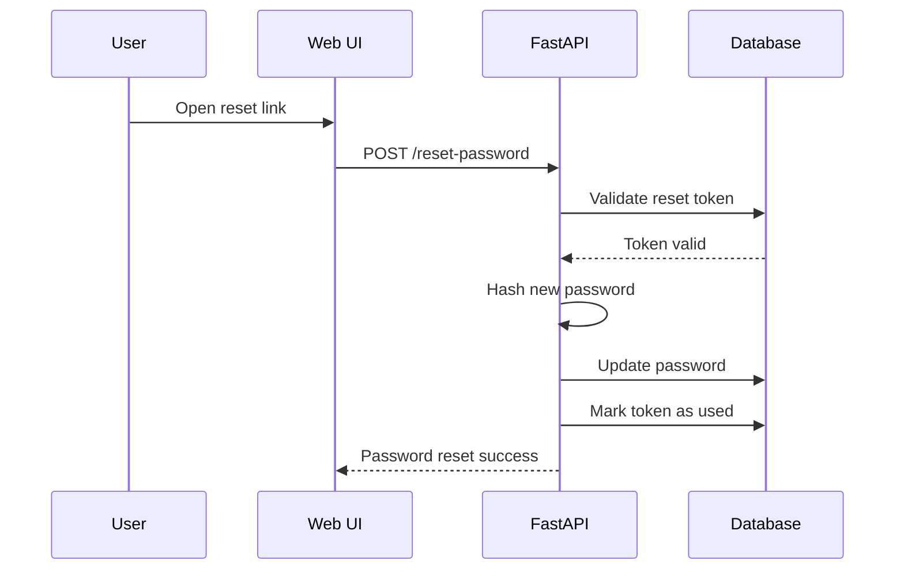
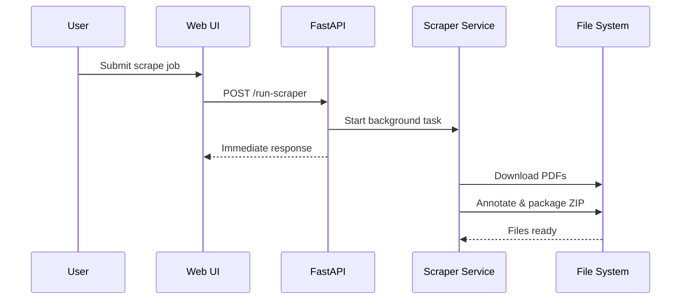

# 🔄 Sequence Diagrams — Core Application Flows

## Purpose
This document provides **sequence diagrams in Markdown** to describe how major application flows behave.

These diagrams:
- Are implementation-agnostic
- Serve as shared mental models
- Reduce ambiguity before coding
- Can be rendered by GitHub using Mermaid

---

## 1. User Registration (Authorization Code Gated)

---

## 2. Login & Session Establishment

---

## 3. Password Reset (Forgot Password)

---

## 4. Password Reset (Token-Based)

---

## 5. Scraper Job Execution

---

## Design Notes

- No scraper results stored in DB
- JWT never exposed to JavaScript
- Email responses are intentionally vague
- Background jobs do not block UI

---

**Documentation Rule:**  
> _If behavior is not shown here, it is undefined._
