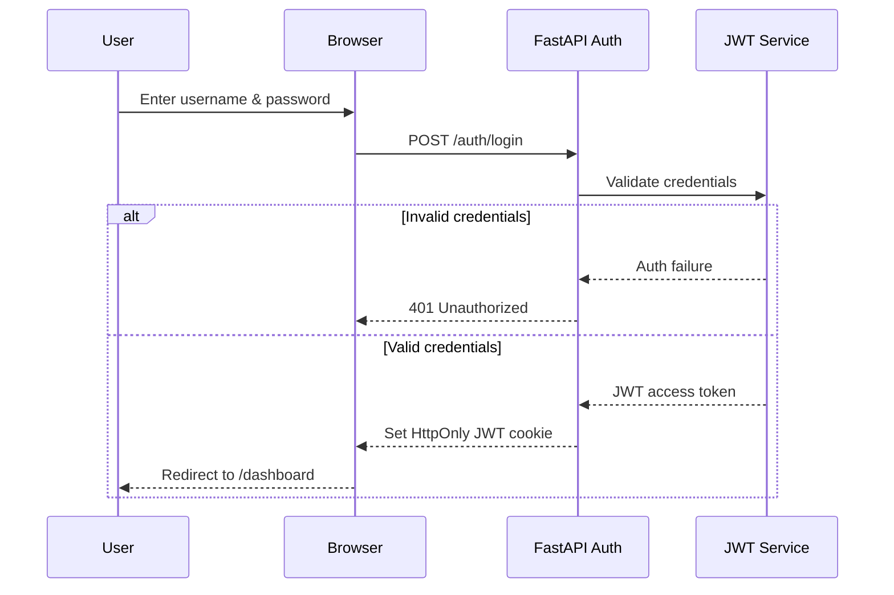
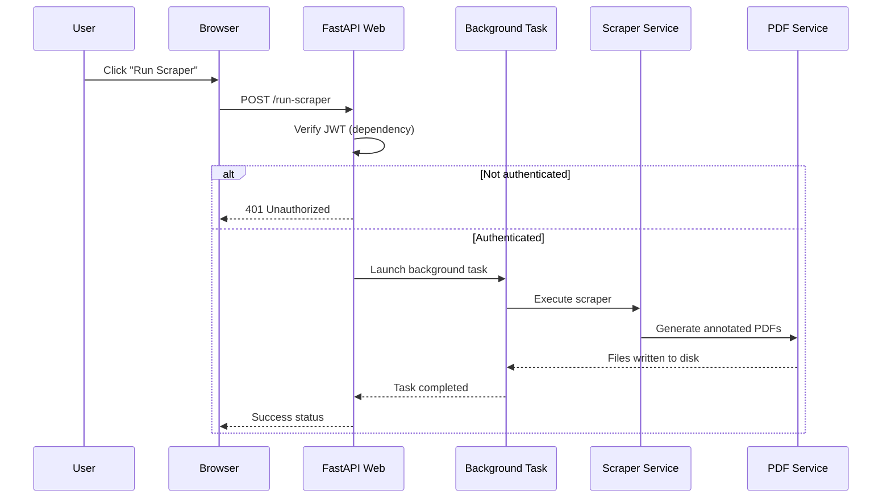

# 🔁 Sequence Diagrams (Core Flows)
*JEA Meeting Minutes Scraper – Web Application*

This document captures the **authoritative interaction flows** for the two core user journeys:
1) Authentication (Login)
2) Scraper Execution

---

## 1️⃣ Login Flow

**Notes**
- JWT stored in **HttpOnly** cookie (no JS access)
- Short-lived access token
- Failed login returns `401` without revealing which field failed

---

## 3️⃣ Scraper Execution Flow

**Notes**
- UI remains responsive (non-blocking)
- Long-running tasks handled asynchronously
- Outputs appear on the Downloads page upon completion

---

## ✅ Completion Criteria

This document is considered complete when:
- Authentication boundaries are explicit
- Background execution is non-blocking
- Failure paths are documented
- No implicit or undocumented steps remain
