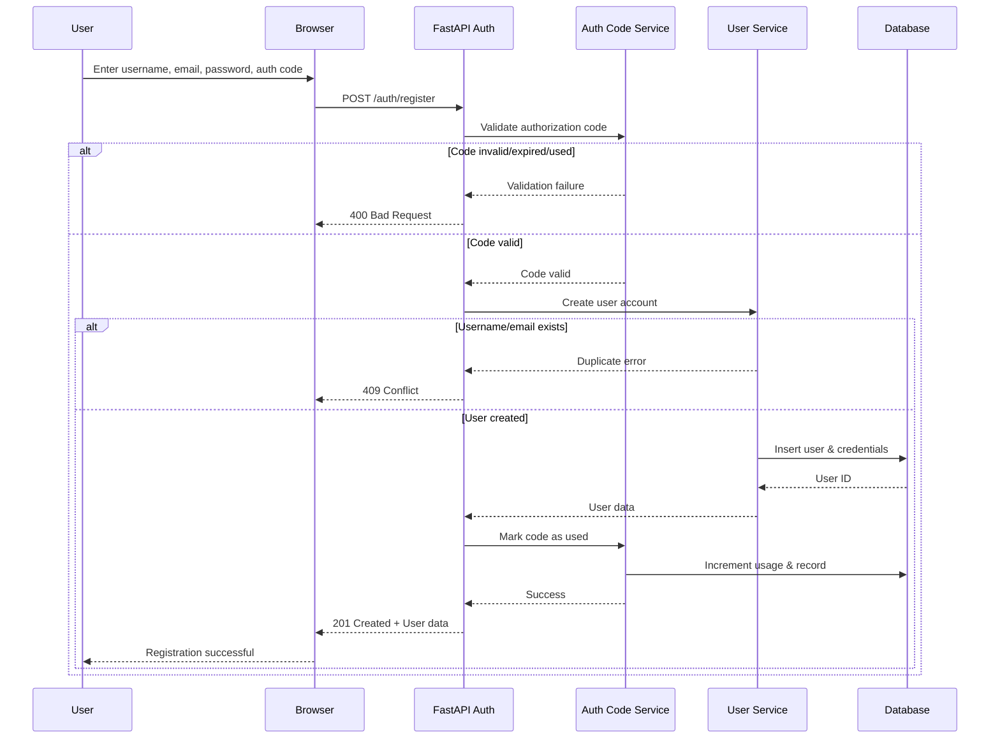
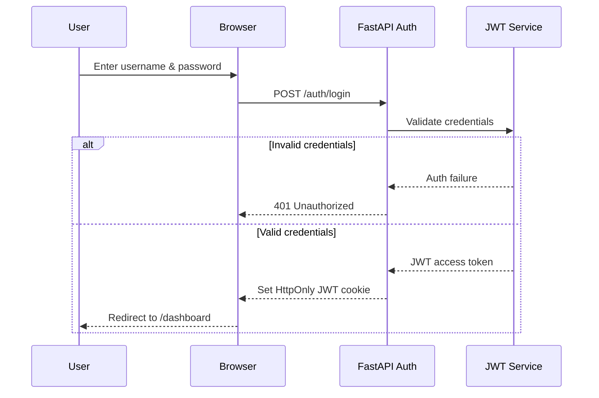
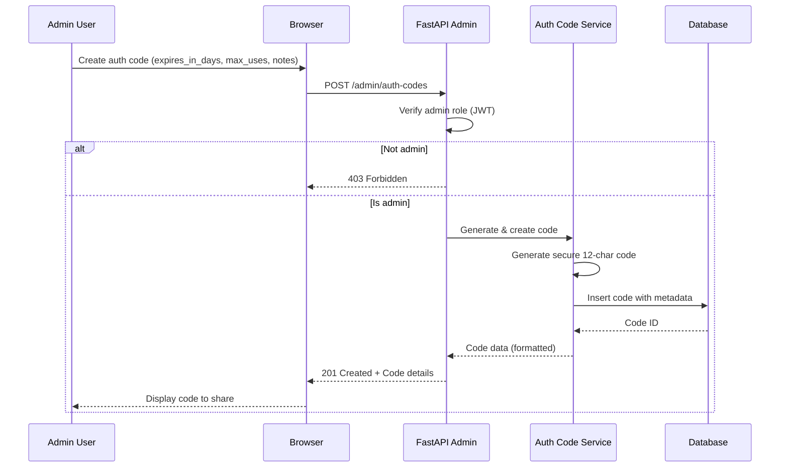
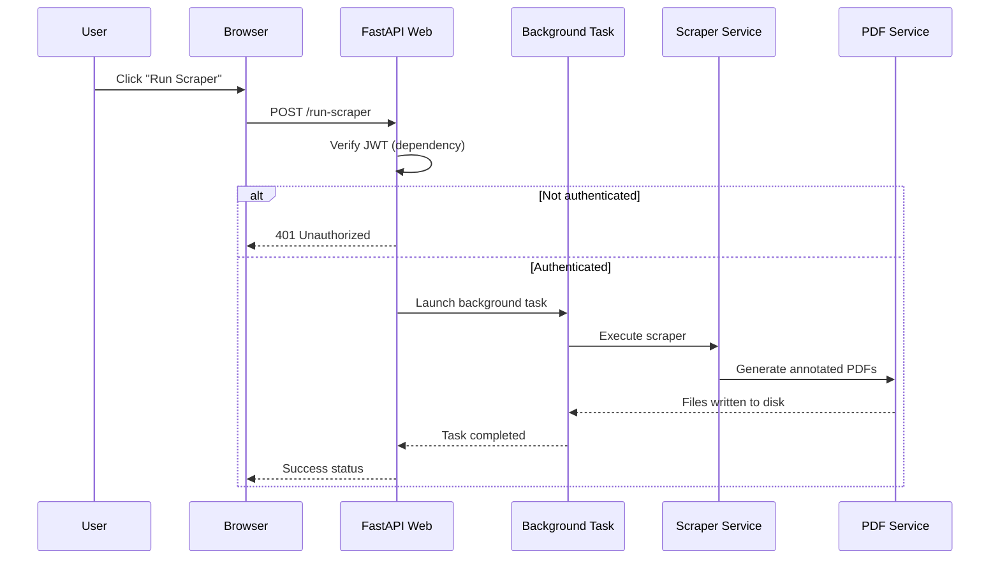

# 🔁 Sequence Diagrams (Core Flows)
*JEA Meeting Minutes Scraper – Web Application*

This document captures the **authoritative interaction flows** for the two core user journeys:
1) Authentication (Login)
2) Scraper Execution

---

## 1️⃣ Registration Flow (with Authorization Code)

**Notes**
- Authorization codes required for all registrations (controlled access)
- Codes can be single-use or multi-use (configurable by admin)
- Codes can have expiration dates
- Registration tracks which code was used by which user
- Failed registrations don't consume code usage

---

## 2️⃣ Login Flow

**Notes**
- JWT stored in **HttpOnly** cookie (no JS access)
- Short-lived access token
- Failed login returns `401` without revealing which field failed

---

## 3️⃣ Admin: Create Authorization Code Flow

**Notes**
- Only admin users can create authorization codes
- Codes are cryptographically secure (12 uppercase alphanumeric chars)
- Format: XXXX-XXXX-XXXX (e.g., A3B7-9K2M-5PQ8)
- Admins can set expiration (days) and usage limits
- Created codes are displayed once and should be saved/shared securely

---

## 4️⃣ Scraper Execution Flow

**Notes**
- UI remains responsive (non-blocking)
- Long-running tasks handled asynchronously
- Outputs appear on the Downloads page upon completion

---

## ✅ Completion Criteria

This document is considered complete when:
- Authentication boundaries are explicit
- Background execution is non-blocking
- Failure paths are documented
- No implicit or undocumented steps remain
