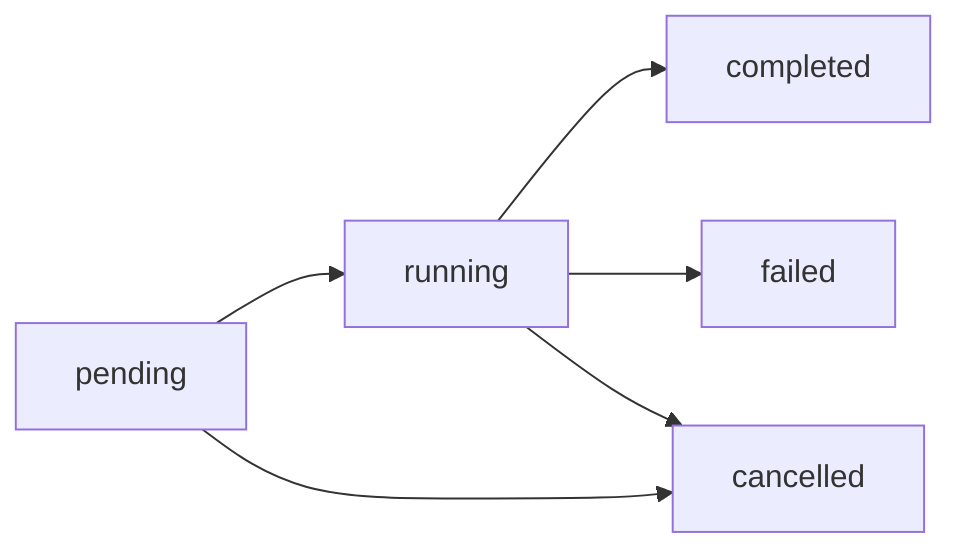

# Scraper API Reference

This document provides comprehensive documentation for the Scraper API endpoints.

## Table of Contents

1. [Authentication](#authentication)
2. [Job Management Endpoints](#job-management-endpoints)
3. [Results Endpoints](#results-endpoints)
4. [Artifact Endpoints](#artifact-endpoints)
5. [Error Codes](#error-codes)
6. [Job Status Lifecycle](#job-status-lifecycle)

---

## Authentication

All scraper endpoints require authentication using Bearer tokens.

```http
Authorization: Bearer <your_access_token>
```

Obtain an access token via the `/auth/login` endpoint.

---

## Job Management Endpoints

### Create Scrape Job

Creates a new scrape job and queues it for background execution.

**Endpoint:** `POST /scraper/jobs`

**Authentication:** Required

**Request Body:**

```json
{
  "client_id": 1,
  "date_range_start": "2024-01",
  "date_range_end": "2024-12",
  "max_scan_pages": 10,
  "include_minutes": true,
  "include_packages": false,
  "source_urls": [
    "https://www.jea.com/About/Board_and_Management/Board_Meetings_Archive/"
  ]
}
```

**Parameters:**

| Field | Type | Required | Description |
|-------|------|----------|-------------|
| `client_id` | integer | Yes | ID of the client to scrape for |
| `date_range_start` | string | No | Start date in YYYY-MM format |
| `date_range_end` | string | No | End date in YYYY-MM format |
| `max_scan_pages` | integer | No | Maximum pages to scan per PDF (null = all) |
| `include_minutes` | boolean | No | Include meeting minutes PDFs (default: true) |
| `include_packages` | boolean | No | Include meeting package PDFs (default: true) |
| `source_urls` | array | Yes | List of URLs to scrape for PDF links |

**Response (201 Created):**

```json
{
  "job_id": 42,
  "status": "pending",
  "message": "Scrape job 42 created and queued for execution"
}
```

**Example:**

```bash
curl -X POST https://api.example.com/scraper/jobs \
  -H "Authorization: Bearer <token>" \
  -H "Content-Type: application/json" \
  -d '{
    "client_id": 1,
    "date_range_start": "2024-01",
    "date_range_end": "2024-12",
    "max_scan_pages": 10,
    "include_minutes": true,
    "include_packages": false,
    "source_urls": ["https://example.com/meetings"]
  }'
```

---

### List Scrape Jobs

List all scrape jobs for the authenticated user with optional filtering.

**Endpoint:** `GET /scraper/jobs`

**Authentication:** Required

**Query Parameters:**

| Parameter | Type | Required | Description |
|-----------|------|----------|-------------|
| `status` | string | No | Filter by job status (pending, running, completed, failed, cancelled) |
| `client_id` | integer | No | Filter by client ID |
| `limit` | integer | No | Results per page (1-1000, default: 100) |
| `offset` | integer | No | Pagination offset (default: 0) |

**Response (200 OK):**

```json
{
  "jobs": [
    {
      "job_id": 42,
      "client_id": 1,
      "client_name": "Test Client",
      "status": "completed",
      "created_by": 5,
      "created_at": 1704067200,
      "started_at": 1704067210,
      "completed_at": 1704067500,
      "error_message": null
    }
  ],
  "total": 1,
  "limit": 100,
  "offset": 0
}
```

**Example:**

```bash
curl -X GET "https://api.example.com/scraper/jobs?status=completed&limit=10" \
  -H "Authorization: Bearer <token>"
```

---

### Get Job Details

Retrieve full details for a specific job including configuration and statistics.

**Endpoint:** `GET /scraper/jobs/{job_id}`

**Authentication:** Required (job creator only)

**Response (200 OK):**

```json
{
  "job_id": 42,
  "client_id": 1,
  "status": "completed",
  "created_by": 5,
  "created_at": 1704067200,
  "started_at": 1704067210,
  "completed_at": 1704067500,
  "error_message": null,
  "config": {
    "config_id": 1,
    "job_id": 42,
    "date_range_start": "2024-01",
    "date_range_end": "2024-12",
    "max_scan_pages": 10,
    "include_minutes": true,
    "include_packages": false
  },
  "statistics": {
    "total_matches": 25,
    "unique_pdfs": 5,
    "unique_keywords": 3,
    "execution_time_seconds": 290
  }
}
```

**Example:**

```bash
curl -X GET https://api.example.com/scraper/jobs/42 \
  -H "Authorization: Bearer <token>"
```

---

### Cancel Scrape Job

Cancel a pending or running scrape job.

**Endpoint:** `DELETE /scraper/jobs/{job_id}`

**Authentication:** Required (job creator only)

**Response (204 No Content)**

No response body on success.

**Example:**

```bash
curl -X DELETE https://api.example.com/scraper/jobs/42 \
  -H "Authorization: Bearer <token>"
```

---

### Get Job Status

Poll the current status of a scrape job (lightweight endpoint for progress updates).

**Endpoint:** `GET /scraper/jobs/{job_id}/status`

**Authentication:** Required (job creator only)

**Response (200 OK):**

```json
{
  "job_id": 42,
  "status": "running",
  "progress": {
    "matches_found": 15
  },
  "error_message": null
}
```

**Example:**

```bash
curl -X GET https://api.example.com/scraper/jobs/42/status \
  -H "Authorization: Bearer <token>"
```

---

## Results Endpoints

### List Job Results

List all matches found by a scrape job with optional filtering and pagination.

**Endpoint:** `GET /scraper/jobs/{job_id}/results`

**Authentication:** Required (job creator only)

**Query Parameters:**

| Parameter | Type | Required | Description |
|-----------|------|----------|-------------|
| `keyword_id` | integer | No | Filter by keyword ID |
| `limit` | integer | No | Results per page (1-1000, default: 100) |
| `offset` | integer | No | Pagination offset (default: 0) |

**Response (200 OK):**

```json
{
  "results": [
    {
      "result_id": 1,
      "job_id": 42,
      "pdf_filename": "minutes_2024-01-15.pdf",
      "page_number": 3,
      "keyword_id": 7,
      "keyword": "solar",
      "snippet": "The board discussed solar energy initiatives...",
      "entities_json": "NASA (ORG), John Smith (PERSON)",
      "created_at": 1704067300
    }
  ],
  "total": 25,
  "limit": 100,
  "offset": 0
}
```

**Example:**

```bash
curl -X GET "https://api.example.com/scraper/jobs/42/results?limit=10" \
  -H "Authorization: Bearer <token>"
```

---

### Get Results Summary

Get aggregated statistics for job results.

**Endpoint:** `GET /scraper/jobs/{job_id}/results/summary`

**Authentication:** Required (job creator only)

**Response (200 OK):**

```json
{
  "job_id": 42,
  "status": "completed",
  "total_matches": 25,
  "unique_pdfs": 5,
  "unique_keywords": 3,
  "keyword_breakdown": [
    {
      "keyword": "solar",
      "match_count": 15
    },
    {
      "keyword": "energy",
      "match_count": 7
    },
    {
      "keyword": "renewable",
      "match_count": 3
    }
  ],
  "execution_time_seconds": 290,
  "created_at": 1704067200,
  "started_at": 1704067210,
  "completed_at": 1704067500
}
```

**Example:**

```bash
curl -X GET https://api.example.com/scraper/jobs/42/results/summary \
  -H "Authorization: Bearer <token>"
```

---

### Export Results as CSV

Download job results as a CSV file.

**Endpoint:** `GET /scraper/jobs/{job_id}/results/export`

**Authentication:** Required (job creator only)

**Response (200 OK):**

Returns a CSV file with headers: `result_id`, `pdf_filename`, `page_number`, `keyword`, `snippet`, `entities`, `created_at`

**Example:**

```bash
curl -X GET https://api.example.com/scraper/jobs/42/results/export \
  -H "Authorization: Bearer <token>" \
  -o results.csv
```

---

## Artifact Endpoints

### Create Job Artifact

Generate a ZIP artifact containing job results and PDFs.

**Endpoint:** `POST /scraper/jobs/{job_id}/artifacts`

**Authentication:** Required (job creator only)

**Status:** 501 Not Implemented (placeholder for future S3/storage integration)

**Request Body:**

```json
{
  "include_raw_pdfs": true,
  "include_annotated_pdfs": true,
  "include_csv": true,
  "include_metadata": true
}
```

---

## Error Codes

| Status Code | Description |
|-------------|-------------|
| 200 | Success |
| 201 | Resource created |
| 204 | Success (no content) |
| 400 | Bad request (invalid parameters) |
| 401 | Unauthorized (missing or invalid token) |
| 403 | Forbidden (not authorized to access resource) |
| 404 | Resource not found |
| 500 | Internal server error |
| 501 | Not implemented |

**Error Response Format:**

```json
{
  "detail": "Job 42 not found"
}
```

---

## Job Status Lifecycle



**Status Descriptions:**

- **pending**: Job is queued and waiting to start
- **running**: Job is currently executing
- **completed**: Job finished successfully
- **failed**: Job encountered an error and terminated
- **cancelled**: Job was cancelled by user before completion

**Status Transitions:**

| From | To | Trigger |
|------|-----|---------|
| pending | running | Background task starts execution |
| running | completed | Job finishes successfully |
| running | failed | Job encounters an error |
| pending | cancelled | User cancels pending job |
| running | cancelled | User cancels running job |

**Cancellation Rules:**
- Only `pending` and `running` jobs can be cancelled
- Completed, failed, and already cancelled jobs cannot be cancelled

---

## Rate Limits

- Job creation: 10 jobs per minute per user
- Status polling: 60 requests per minute per job
- Results retrieval: 100 requests per minute per user

---

## Best Practices

1. **Poll job status** every 5-10 seconds rather than continuously
2. **Use pagination** for large result sets (limit to 100 results per page)
3. **Filter by status** when listing jobs to reduce response size
4. **Set max_scan_pages** appropriately to balance speed vs completeness
5. **Cancel jobs** that are no longer needed to free up resources

---

## Support

For API support, please contact the development team or file an issue at:
https://github.com/your-org/minutes-iq/issues
