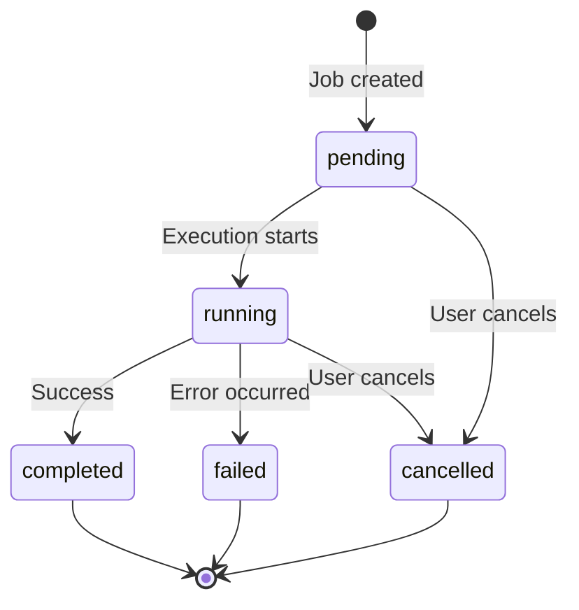
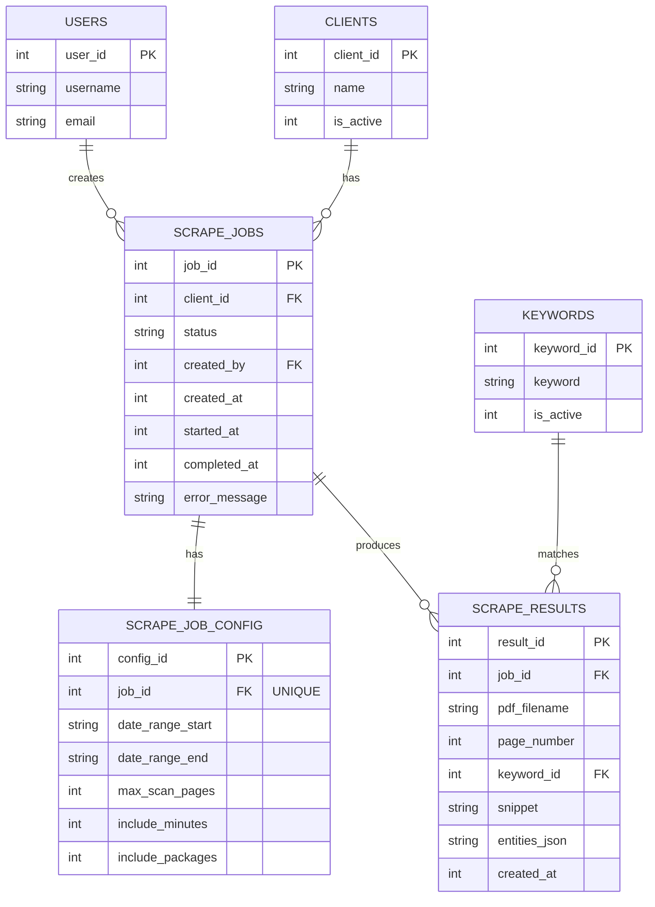

# Scraper Data Model

This document describes the database schema for the scraper orchestration system.

## Table of Contents

1. [Overview](#overview)
2. [Tables](#tables)
3. [Relationships](#relationships)
4. [Constraints and Indexes](#constraints-and-indexes)
5. [Status Enums](#status-enums)
6. [Entity Relationship Diagram](#entity-relationship-diagram)

---

## Overview

The scraper data model consists of three main tables:

- **scrape_jobs** - Job metadata and execution tracking
- **scrape_job_config** - Job configuration parameters
- **scrape_results** - Individual match results

These tables integrate with the existing `clients`, `keywords`, and `users` tables.

---

## Tables

### scrape_jobs

Stores metadata for each scrape job and tracks execution status.

| Column | Type | Nullable | Description |
|--------|------|----------|-------------|
| `job_id` | INTEGER | No | Primary key (auto-increment) |
| `client_id` | INTEGER | No | Foreign key to `clients.client_id` |
| `status` | TEXT | No | Job status (see Status Enums) |
| `created_by` | INTEGER | No | Foreign key to `users.user_id` |
| `created_at` | TEXT | No | Job creation timestamp (Unix epoch) |
| `started_at` | TEXT | Yes | Job start timestamp (Unix epoch) |
| `completed_at` | TEXT | Yes | Job completion timestamp (Unix epoch) |
| `error_message` | TEXT | Yes | Error message if job failed |

**Constraints:**
- `status` must be one of: `pending`, `running`, `completed`, `failed`, `cancelled`
- `client_id` references `clients(client_id)` with ON DELETE RESTRICT
- `created_by` references `users(user_id)` with ON DELETE RESTRICT

**Indexes:**
- Primary key on `job_id`
- Index on `client_id` for client-based queries
- Index on `created_by` for user-based queries
- Index on `status` for status filtering

---

### scrape_job_config

Stores configuration parameters for each scrape job.

| Column | Type | Nullable | Description |
|--------|------|----------|-------------|
| `config_id` | INTEGER | No | Primary key (auto-increment) |
| `job_id` | INTEGER | No | Foreign key to `scrape_jobs.job_id` (unique) |
| `date_range_start` | TEXT | Yes | Start date in YYYY-MM format |
| `date_range_end` | TEXT | Yes | End date in YYYY-MM format |
| `max_scan_pages` | INTEGER | Yes | Maximum pages to scan per PDF (null = all) |
| `include_minutes` | INTEGER | No | Include meeting minutes PDFs (0/1, default: 1) |
| `include_packages` | INTEGER | No | Include meeting packages PDFs (0/1, default: 1) |

**Constraints:**
- `job_id` is UNIQUE (one config per job)
- `job_id` references `scrape_jobs(job_id)` with ON DELETE CASCADE
- `include_minutes` and `include_packages` are boolean (0 or 1)

**Indexes:**
- Primary key on `config_id`
- Unique index on `job_id`

---

### scrape_results

Stores individual keyword matches found during scraping.

| Column | Type | Nullable | Description |
|--------|------|----------|-------------|
| `result_id` | INTEGER | No | Primary key (auto-increment) |
| `job_id` | INTEGER | No | Foreign key to `scrape_jobs.job_id` |
| `pdf_filename` | TEXT | No | Name of the PDF file |
| `page_number` | INTEGER | No | Page number where match was found (1-indexed) |
| `keyword_id` | INTEGER | No | Foreign key to `keywords.keyword_id` |
| `snippet` | TEXT | No | Text snippet containing the match (max 300 chars) |
| `entities_json` | TEXT | Yes | NLP entities extracted from snippet (JSON or string) |
| `created_at` | TEXT | No | Result creation timestamp (Unix epoch) |

**Constraints:**
- `job_id` references `scrape_jobs(job_id)` with ON DELETE CASCADE
- `keyword_id` references `keywords(keyword_id)` with ON DELETE RESTRICT

**Indexes:**
- Primary key on `result_id`
- Index on `job_id` for job-based queries
- Index on `keyword_id` for keyword-based queries
- Composite index on `(job_id, keyword_id)` for filtered queries

---

## Relationships

```
users (1) ----< (N) scrape_jobs
clients (1) ----< (N) scrape_jobs
scrape_jobs (1) ----< (1) scrape_job_config
scrape_jobs (1) ----< (N) scrape_results
keywords (1) ----< (N) scrape_results
```

**Relationship Types:**

1. **users → scrape_jobs** (1:N)
   - One user can create many scrape jobs
   - Tracked via `scrape_jobs.created_by`

2. **clients → scrape_jobs** (1:N)
   - One client can have many scrape jobs
   - Tracked via `scrape_jobs.client_id`

3. **scrape_jobs → scrape_job_config** (1:1)
   - Each job has exactly one configuration
   - Cascading delete: deleting job deletes config

4. **scrape_jobs → scrape_results** (1:N)
   - One job can have many results
   - Cascading delete: deleting job deletes all results

5. **keywords → scrape_results** (1:N)
   - One keyword can match in many results
   - Restricted delete: cannot delete keyword with results

---

## Constraints and Indexes

### Foreign Key Constraints

**ON DELETE Behaviors:**

| Table | Column | References | ON DELETE |
|-------|--------|------------|-----------|
| scrape_jobs | client_id | clients(client_id) | RESTRICT |
| scrape_jobs | created_by | users(user_id) | RESTRICT |
| scrape_job_config | job_id | scrape_jobs(job_id) | CASCADE |
| scrape_results | job_id | scrape_jobs(job_id) | CASCADE |
| scrape_results | keyword_id | keywords(keyword_id) | RESTRICT |

**Rationale:**
- **RESTRICT** prevents orphaned jobs (can't delete users/clients/keywords with active jobs)
- **CASCADE** auto-cleans related data (deleting job removes config and results)

### Check Constraints

```sql
-- Job status must be valid
CHECK (status IN ('pending', 'running', 'completed', 'failed', 'cancelled'))

-- Boolean fields (SQLite uses integers)
CHECK (include_minutes IN (0, 1))
CHECK (include_packages IN (0, 1))
```

---

## Status Enums

### Job Status Values

| Status | Description | Terminal? | Can Cancel? |
|--------|-------------|-----------|-------------|
| `pending` | Job is queued, not yet started | No | Yes |
| `running` | Job is currently executing | No | Yes |
| `completed` | Job finished successfully | Yes | No |
| `failed` | Job encountered an error | Yes | No |
| `cancelled` | Job was cancelled by user | Yes | No |

**Terminal Statuses:** `completed`, `failed`, `cancelled`
- Terminal statuses cannot be changed
- Jobs in terminal status cannot be cancelled

### Status Transition Rules



**Valid Transitions:**

| From | To | Trigger |
|------|-----|---------|
| pending | running | Background task picks up job |
| running | completed | Job execution succeeds |
| running | failed | Job encounters error |
| pending | cancelled | User cancels via DELETE endpoint |
| running | cancelled | User cancels via DELETE endpoint |

**Invalid Transitions:**
- Cannot go from `completed`/`failed`/`cancelled` to any other status
- Cannot skip from `pending` directly to `completed` or `failed`

---

## Entity Relationship Diagram



---

## Migration Script

The scraper tables are created via migration script:

**File:** `src/minutes_iq/db/schema/005_add_scraper_orchestration.sql`

```sql
-- See migration file for complete DDL
CREATE TABLE IF NOT EXISTS scrape_jobs ( ... );
CREATE TABLE IF NOT EXISTS scrape_job_config ( ... );
CREATE TABLE IF NOT EXISTS scrape_results ( ... );
```

---

## Data Retention

**Considerations:**

1. **Completed Jobs**: Keep indefinitely or implement archival policy
2. **Failed Jobs**: Retain for debugging (recommend 90 days)
3. **Cancelled Jobs**: Can be purged after 30 days
4. **Results**: Keep as long as job exists (cascade delete)

**Recommended Policy:**

```sql
-- Archive old completed jobs (older than 1 year)
-- Delete failed/cancelled jobs (older than 90 days)
-- This is a manual process; automated cleanup should be implemented
```

---

## Performance Considerations

### Recommended Indexes

```sql
-- Job listing by user and status
CREATE INDEX idx_jobs_user_status ON scrape_jobs(created_by, status);

-- Job listing by client
CREATE INDEX idx_jobs_client ON scrape_jobs(client_id);

-- Results by job (already implicit from FK)
CREATE INDEX idx_results_job ON scrape_results(job_id);

-- Results by keyword
CREATE INDEX idx_results_keyword ON scrape_results(keyword_id);
```

### Query Optimization Tips

1. **Use status index** when filtering jobs: `WHERE status = 'completed'`
2. **Use pagination** for large result sets: `LIMIT/OFFSET`
3. **Aggregate statistics** are computed on-demand (consider caching)
4. **Bulk operations** should be done in transactions

---

## Backup Strategy

**Critical Data:**
- All scrape_jobs records (audit trail)
- All scrape_results records (expensive to regenerate)

**Configuration Data:**
- scrape_job_config (can be reconstructed from job parameters)

**Backup Frequency:**
- Daily incremental backups
- Weekly full backups
- Retain for 30 days

---

## Support

For schema questions or migrations, contact the database team or file an issue at:
https://github.com/your-org/minutes-iq/issues
